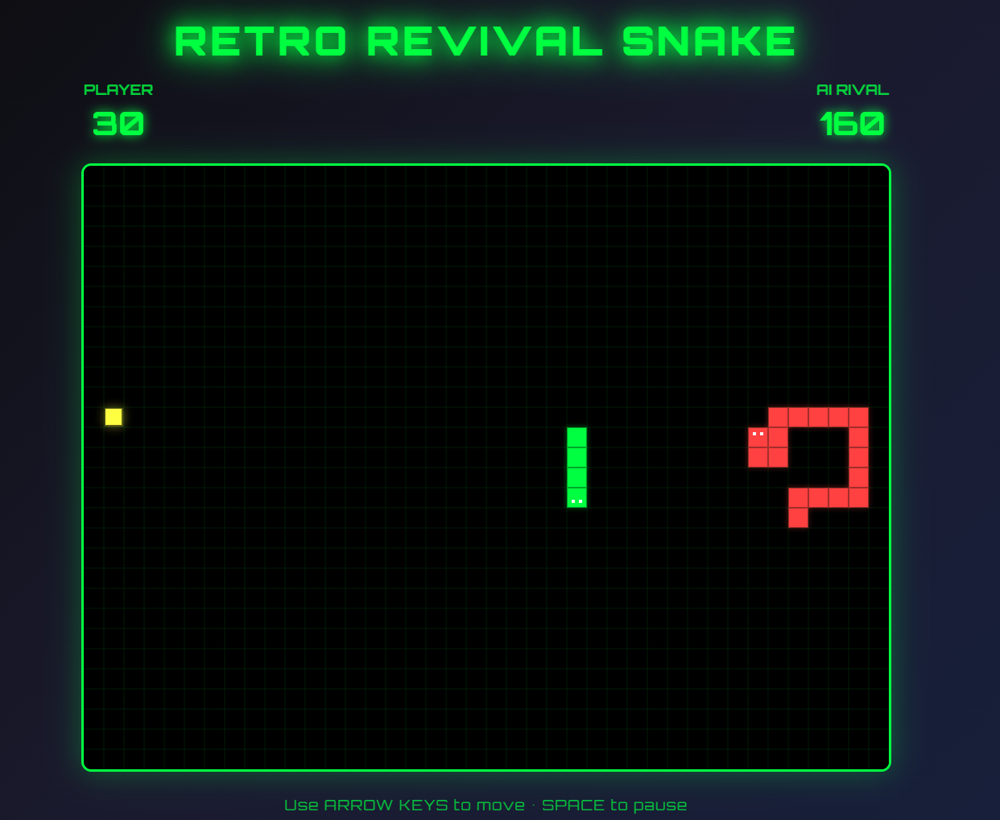

<p align="center">
  
</p>

# Retro Revival Snake Game 

A modern take on the classic Snake game featuring retro aesthetics and an intelligent AI opponent using BFS pathfinding.

##  Features

- **Classic Snake Gameplay**: Smooth arrow key controls with responsive movement
- **BFS AI Rival**: Intelligent opponent using Breadth-First Search pathfinding for optimal routes
- **Competitive AI**: Strategic blocking, interception, and food racing behaviors
- **Retro Aesthetics**: Pixel-perfect graphics with authentic CRT effects and glow
- **Chiptune Audio**: 8-bit style sound effects and background music
- **Settings System**: Adjustable volume, AI difficulty, and sound toggle
- **High Scores**: Local storage of top 10 scores with winner tracking
- **Responsive Design**: Works perfectly on desktop and mobile devices

##  Quick Start

### Option 1: Direct Browser Play (Recommended)
1. Download or clone the repository
2. Navigate to the `retro-revival-kiro-snake` folder
3. **Double-click `index.html`** to open in your browser
4. Start playing immediately!

### Option 2: Local Server (If needed)
If direct browser access doesn't work due to CORS:
```bash
# In the project folder
python -m http.server 8000
# Then open http://localhost:8000
```

### Option 3: Development Mode (Advanced)
```bash
npm install
npm run dev
# Open http://localhost:5173
```

## How to Play

- Use **Arrow Keys** to control your snake (green)
- Eat the yellow food to grow and score points
- Avoid walls, your own tail, and the AI snake (red)
- Compete against the AI to get the highest score
- Press **Space** to pause the game

## Game Controls

- **↑ ↓ ← →**: Move snake
- **Space**: Pause/Resume
- **Mouse**: Navigate menus

## AI Features

### BFS Pathfinding Algorithm
- **Optimal Routes**: Always finds the shortest path to food
- **Real-time Calculation**: Updates paths dynamically as game state changes
- **Performance Optimized**: Calculations complete within 16ms for 60 FPS

### Competitive Behaviors
- **Food Racing**: Direct competition for food acquisition
- **Strategic Blocking**: Positions to block player access to food
- **Survival Mode**: Prioritizes safety when no food path exists
- **Adaptive Difficulty**: Easy, Medium, Hard settings affect AI speed and aggression

##  Game Features

### Settings Menu
- **Volume Control**: Adjustable audio levels (0-100%)
- **AI Difficulty**: Easy, Medium, Hard difficulty levels
- **Sound Toggle**: Enable/disable all audio effects
- **Persistent Storage**: Settings saved automatically

### High Scores System
- **Top 10 Tracking**: Stores best player scores locally
- **Winner Recording**: Tracks whether player, AI, or draw
- **Date Stamps**: Shows when each score was achieved
- **Visual Rankings**: Gold, silver, bronze highlighting for top 3

## Technical Details

### Architecture
- **Frontend**: Vanilla JavaScript with HTML5 Canvas
- **AI Algorithm**: Breadth-First Search (BFS) pathfinding
- **Audio**: Web Audio API for chiptune sound generation
- **Storage**: LocalStorage for settings and high scores
- **Performance**: 60 FPS gameplay with optimized rendering

### Browser Compatibility
- **Modern Browsers**: Chrome, Firefox, Safari, Edge
- **Mobile Support**: Touch-friendly responsive design
- **No Dependencies**: Runs directly in browser without build tools

## Contributing

1. Fork the repository
2. Create a feature branch
3. Make your changes
4. Test thoroughly
5. Submit a pull request

## License

MIT License - see LICENSE file for details
